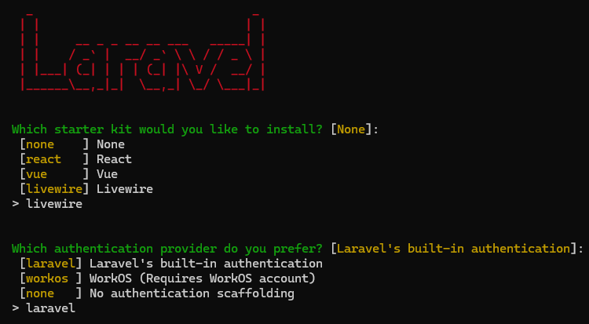

# 🚀 Laravel + Docker Setup Guide — Inventory MSU

Panduan lengkap untuk menjalankan dan mengembangkan proyek **Inventory MSU** berbasis **Laravel + Docker** di Windows.

---

## 🧩 Pre-Requisites
Pastikan kamu sudah menginstal hal-hal berikut di komputermu:

1. **Composer**
2. **XAMPP 8.2.\*** (untuk PHP & MySQL lokal)
3. **PHP 8.4.\*** (sesuaikan dengan versi Laravel)
4. **VS Code** (atau IDE lain)
5. **Docker Desktop**

---

## ⚙️ Initial Laravel Setup

1. Buka **terminal** di folder project.

2. Jalankan perintah berikut:
    
    ```bash
    composer global require laravel/installer
    ```

    Ikuti instruksi di layar untuk memilih starter kit dan testing framework.

    
    

3. Setelah instalasi selesai, Laravel siap digunakan.

---

## 🐳 Setup Docker Environment

1. Pastikan **Docker Desktop** sudah dijalankan.

2. Pastikan di root project kamu sudah ada file berikut:
    - `Dockerfile`
    - `docker-compose.yml`
    - `nginx.conf`
    - `.env.docker`

3. Jalankan perintah berikut untuk pertama kali:
    
    ```bash
    docker compose up -d --build
    ```

4. Generate `APP_KEY`:
    
    ```bash
    docker exec -it inventori-msu-app php artisan key:generate --env=.env.docker
    ```

5. Jalankan migrasi database:
    
    ```bash
    docker exec -it inventori-msu-app php artisan migrate --env=.env.docker
    ```

6. Jalankan Vite untuk build asset (mode dev):
    
    ```bash
    docker exec -it inventori-msu-vite npm run dev
    ```

7. Buka browser dan akses:
    
    👉 [http://localhost:8080](http://localhost:8080)

---

## 🧠 Catatan Penting

Docker Compose memiliki tiga level perubahan utama:

1. **Build image baru (`--build`)**  
    → jika kamu ubah *Dockerfile* atau dependensi (Composer/NPM).  

2. **Restart container**  
    → jika kamu ubah konfigurasi `docker-compose.yml` atau `.env.docker`.  

3. **Auto-reload kode**  
    → jika kamu hanya ubah file Laravel (controller, view, route, dll).  
    Docker akan langsung mendeteksi karena kita pakai **bind mount** (`- ./:/var/www`).

---

## 🔁 Jika Ada Perubahan

| Perubahan yang Kamu Lakukan                            | Harus Jalankan Apa                                                                  |
| ------------------------------------------------------ | ----------------------------------------------------------------------------------- |
| 🧑‍💻 Ubah file Laravel (controller, view, route, dll) | **Cukup reload browser saja** 🚀                                                    |
| 🎨 Ubah CSS/JS (Vite)                                  | Jalankan `npm run dev` di container `vite` (atau biarkan service `vite` tetap nyala) |
| ⚙️ Ubah file `.env.docker`                             | `docker compose restart app`                                                        |
| 🧩 Ubah `Dockerfile`                                   | `docker compose up -d --build`                                                      |
| 🧱 Ubah `docker-compose.yml`                           | `docker compose up -d`                                                              |
| 🗄️ Tambah migration baru                              | `docker exec -it inventori-msu-app php artisan migrate`                             |
| 🧰 Ubah dependency Composer                            | `docker exec -it inventori-msu-app composer install`                                |
| 🪄 Ubah dependency NPM                                 | `docker exec -it inventori-msu-vite npm install`                                    |
| 🪣 Reset database                                      | `docker compose down -v && docker compose up -d`                                    |

---

## ▶️ Jalankan Langsung Setelah Clone Repository

Langkah ini digunakan jika kamu **baru clone repo Laravel + Docker** dari GitHub:

1. Jalankan **Docker Desktop**.

2. Masuk ke folder project, lalu jalankan:
    
    ```bash
    docker compose up -d --build
    ```

3. Generate `APP_KEY`:
    
    ```bash
    docker exec -it inventori-msu-app php artisan key:generate --env=.env.docker
    ```

4. Jalankan migrasi database:
    
    ```bash
    docker exec -it inventori-msu-app php artisan migrate --env=.env.docker
    ```

5. Jalankan Vite untuk mode development:
    
    ```bash
    docker exec -it inventori-msu-vite npm run dev
    ```

6. Akses website di browser:
    
    👉 [http://localhost:8080](http://localhost:8080)

---

## 🧭 Workflow Cepat (Development)

| Langkah Cepat | Perintah |
|----------------|-----------|
| Nyalakan semua container | `docker compose up -d` |
| Jalankan migrasi | `docker exec -it inventori-msu-app php artisan migrate` |
| Jalankan Vite dev server | `docker exec -it inventori-msu-vite npm run dev` |
| Hentikan semua container | `docker compose down` |
| Reset database | `docker compose down -v && docker compose up -d` |

---

## 🧰 Tips Tambahan

- Jalankan perintah **Artisan** langsung di container:
    
    ```bash
    docker exec -it inventori-msu-app php artisan route:list
    docker exec -it inventori-msu-app php artisan make:model Item -mcr
    ```

- Install atau update dependency **Composer**:
    
    ```bash
    docker exec -it inventori-msu-app composer install
    ```

- Build asset untuk **production**:
    
    ```bash
    docker exec -it inventori-msu-vite npm run build
    ```

---

## 🧾 Credit
Disusun oleh **Habb**  
> Panduan resmi pengembangan dan deployment proyek **Inventory MSU**  
> Laravel + Docker Development Workflow 💚
